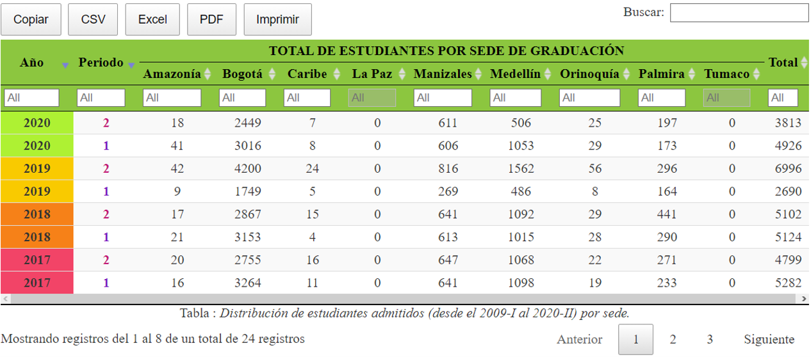
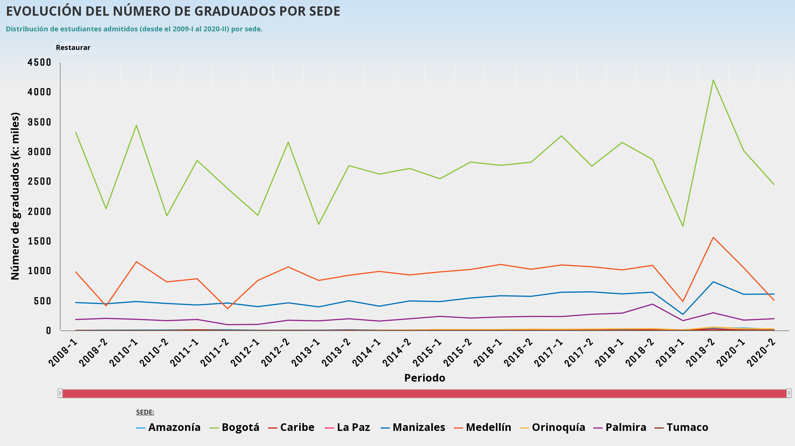
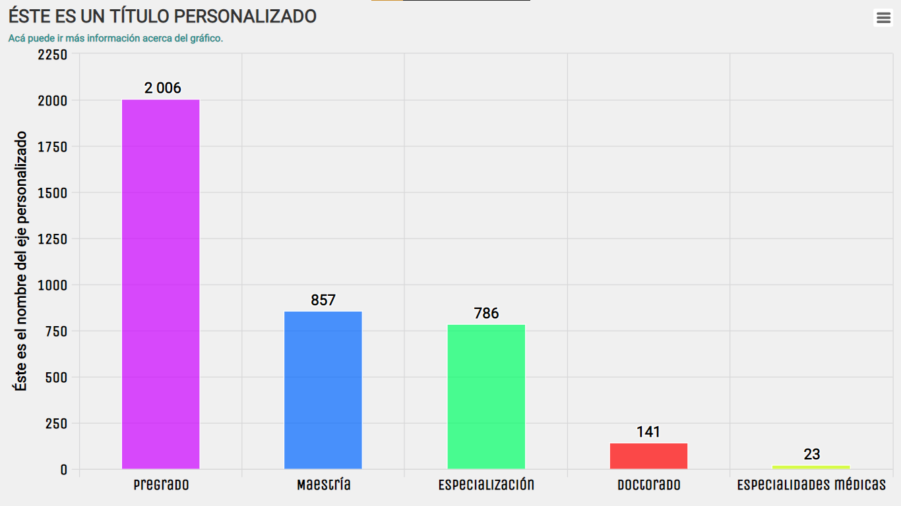
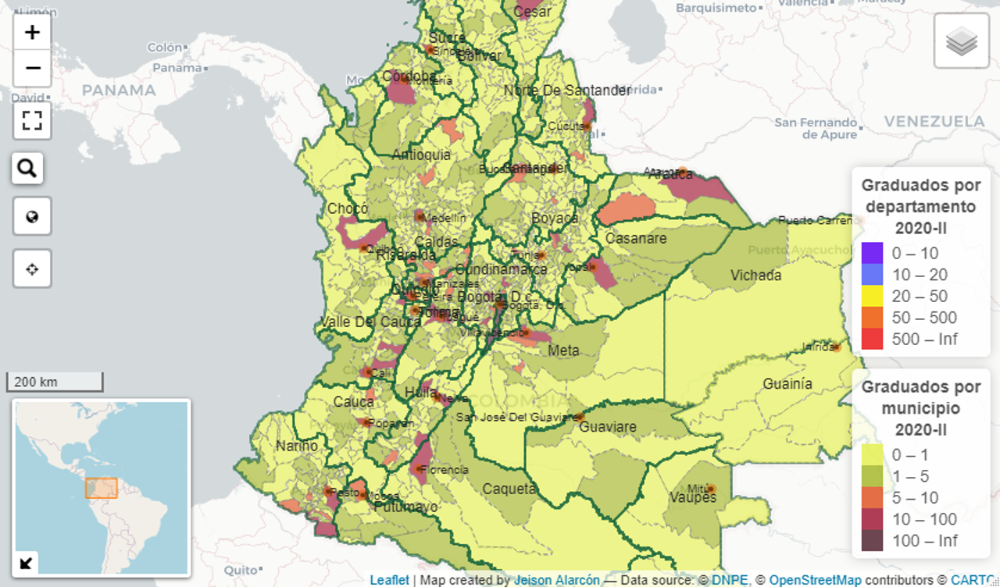

# UnalR <a href='http://estadisticaun.github.io/UnalR'></a>

El paquete `UnalR` proporciona métodos y herramientas para mostrar y analizar datos estadísticos. Su objetivo es disponer, facilitar y optimizar la disposición de microdatos y la visualización de las cifras y estadísticas oficiales de la [Universidad Nacional de Colombia](https://unal.edu.co). Contiene una biblioteca de funciones gráficas, tanto estáticas como interactivas, que ofrece numerosos tipos de gráficos con una sintaxis altamente configurable y simple. Entre estos encontramos la visualización de tablas HTML, series, gráficos de barras y circulares, mapas, etc. Todo lo anterior apoyado en bibliotecas de JavaScript.

El paquete `UnalR` permanecerá en su estado actual y se mantendrá solo con correcciones de errores.

## Instalación

Puede instalar la versión publicada de `UnalR` (*versión de desarrollo*) desde [GitHub](https://github.com/) con:

``` r
# install.packages("devtools")
devtools::install_github("estadisticaun/UnalR")

# install.packages("remotes")
remotes::install_github("estadisticaun/UnalR")
```

## Uso

Es difícil describir de manera sucinta cómo funciona `UnalR` porque encarna una profunda filosofía de visualización que abarca las principales librerías para representar de forma dinámica e interactiva datos usando `JavaScript` (**htmlwidgets**).

## Ejemplo

``` r
library(UnalR)
example(topic = Tabla, package = "UnalR")
```


``` r
example(topic = Plot.Series, package = "UnalR")
```


``` r
example(topic = Plot.Barras, package = "UnalR")
```


``` r
example(topic = Plot.Mapa, package = "UnalR")
```



## Licencia

Este paquete es un software gratuito y de código abierto, con licencia GPL-3.

## Ayuda

Si requiere ayuda para usar `UnalR`:

  * Para problemas de instalación, comuníquese a los correos electrónicos proporcionados en la documentación del paquete, normalmente respondemos con prontitud y usted también ayudará a futuros usuarios.

Si cree que ha encontrado un error:

  * Instale la versión de desarrollo de `UnalR` usando `devtools` (*ver arriba*) y vea si eso ayuda.
  * Consulte los [problemas de github](https://github.com/estadisticaun).

¡Gracias por tu interés en `UnalR`!
